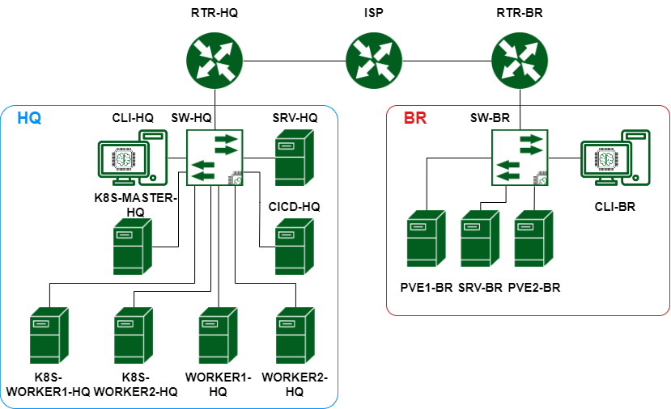

# Конкурсное задание финал_v9

[Критерии оценивания](Критерии_оценивания.xlsx){:download="Критерии_оценивания.xlsx"}

## 1.5.2. Структура модулей конкурсного задания (инвариант/вариатив)

**Модуль Б. (*Настройка технических и программных средств информационно-коммуникационных систем*)**

***Время на выполнение модуля 5 часов.***

*Доступ к ISP вы не имеете!!*

Рисунок 1. Топология

| Название устройства | ОС |
| --- | --- |
| RTR-HQ | Eltex vESR |
| RTR-BR | Eltex vESR |
| SRV-HQ | Astra Linux 1.7 |
| SRV-BR | Astra Linux 1.7 |
| CLI-HQ | Astra Linux 1.7 |
| CLI-BR | Альт Рабочая станция 10 |
| SW-HQ | AstraLinux 1.7 |
| SW-BR | Альт Сервер 10 |
| PVE1-BR | Proxmox 8.0.3 |
| PVE2-BR-BR | Proxmox 8.0.3 |
| CICD-HQ | Debian 11 |
| K8S-MASTER-HQ | Debian 11 |
| WORKER1-HQ-HQ | Debian 11 |
| WORKER2-HQ-HQ | Debian 11 |
| K8S-WORKER1-HQ | Debian 11 |
| K8S-WORKER2-HQ | Debian 11 |

**Задания:**

1. **Базовая настройка**
2. Настройте имена устройств согласно топологии
    1. Используйте полное доменное имя
3. Сконфигурируйте адреса устройств на свое усмотрение. Для офиса HQ выделена сеть 10.0.10.0/24, для офиса BR выделена сеть 10.0.20.0/24. Данные сети необходимо разделить на подсети для каждого vlan.
4. На SRV-HQ и SRV-BR, создайте пользователя sshuser с паролем P@ssw0rd
    1. Пользователь sshuser должен иметь возможность запуска утилиты sudo без дополнительной аутентификации.
    2. Запретите парольную аутентификацию. Аутентификация пользователя sshuser должна происходить только при помощи ключей
    3. Измените стандартный ssh порт на 2023
    4. На **CLI-HQ** сконфигурируйте клиент для автоматического подключения к SRV-HQ и SRV-BR под пользователем **sshuser**. При подключении автоматически должен выбираться корректный порт. Создайте пользователя **sshuser** на **CLI-HQ** для обеспечения такого сетевого доступа.
5. **Настройка дисковой подсистемы**
6. На **SRV-HQ** настройте зеркалируемый LVM том
    1. Используйте два неразмеченных жестких диска
    2. Настройте автоматическое монтирование логического тома
    3. Точка монтирования /opt/data.
7. На **SRV-BR** сконфигурируйте stripped LVM том.
    1. Используйте два неразмеченных жестких диска
    2. Настройте автоматическое монтирование тома
    3. Обеспечьте шифрование тома средствами dm-crypt. Диск должен монтироваться при загрузке ОС без запроса пароля.
    4. Точка монтирования /opt/data
8. Настройка коммутации
    1. В качестве коммутаторов используются SW-HQ и SW-BR.
    2. В обоих офисах сервера должны находится во vlan100, клиенты во vlan200, management подсеть во vlan300
    3. Создайте management интерфейсы на коммутаторах
    4. Для каждого vlan рассчитайте подсети, выданные для офисов. Количество хостов в каждой подсети не должно превышать 30-ти.
    5. Создайте vlan400 для Proxmox. Этот VLAN является внутренним для всех виртуальных машин, развернутых в кластере.
9. **Установка и настройка сервера баз данных**
10. В качестве серверов баз данных используйте сервера **SRV-HQ** и **SRV-BR**
11. Разверните сервер баз данных на базе Postgresql
    1. Создайте базы данных prod, test, dev
        1. Заполните базы данных тестовыми данными при помощи утилиты pgbench. Коэфицент масштабирования сохраните по умолчанию.
    2. Создайте пользователей produser, testuser, devuser, каждому из пользователей дайте доступ к соответствующей базе данных.
    3. Создайте пользователя dbadmin. Пользователь должен обладать привилегиями суперпользователя.
    4. Разрешите внешние подключения для всех пользователей.
    5. Сконфигурируйте репликацию с **SRV-HQ** на **SRV-BR**
    6. Обеспечьте отказоустойчивость СУБД при помощи HAProxy.
        1. HAProxy установите на **SW-HQ.**
        2. Режим балансировки – Hot-Standby: Активным необходимо сделать только SRV-HQ. В случае отказа SRV-HQ активным сервером должен становится SRV-BR.
        3. Выбор standby режима (RO/RW) остается на усмотрение участника.
        4. Обеспечьте единую точку подключения к СУБД по имени dbms.company.prof
12. Для администрирования сервера баз данных разверните приложение CloudDBeaver
    1. Веб панель CloudDBeaver должна быть доступна по адресу db-adm.company.prof
    2. Доступ к CloudDBeaver должен быть защищен при помощи сертификатов. Ошибок доверия возникать не должно
    3. Доступ к консоли CloudDBeaver должен быть для пользователя cbadmin с паролем P@ssw0rd
        1. Система должна быть подключена к базе данных с правами RW.
13. **Настройка системы централизованного журналирования**
14. В качестве сервера системы централизованного журналирования используйте **SRV-HQ**
15. В качестве системы централизованного журналирования используйте Rsyslog совместно с веб панелью LogAnalyzer
    1. Настройте Rsyslog
        1. Настройте взаимосвязь сервера баз данных с Rsyslog
            1. В качестве сервера баз данных используйте postgresql.
        2. Настройте возможность приема сообщений по протоколам TCP и UDP по порту 514
    2. Установите LogAnalyzer
        1. Установочные файлы находятся в addons_final.iso
        2. Для подключения к базе данных создайте пользователя logs и базу данных logs. У пользователя должны быть полные права на его базу данных.
        3. Веб панель LogAnalyzer должна быть доступна по адресу logs.company.prof
        4. Для авторизации в веб панели LogAnalyzer необходимо использовать пользователя admin с паролем P@ssw0rd
        5. Защитите подключение к loganalyzer при помощи https. При подключении не должно возникать ошибок, связанных с сертификатами.
16. Настройте централизованный сбор журналов с хостов RTR-HQ, RTR-BR, SRV-HQ, SRV-BR.
17. **Настройка системы централизованного мониторинга**
18. В качестве сервера системы централизованного мониторинга используйте **SRV-HQ**
19. В качестве системы централизованного мониторинга используйте Zabbix
    1. Вам доступна документация на сайте https://www.zabbix.com/ru/
    2. В качестве сервера баз данных используйте postgresql
20. Система централизованного мониторинга должна быть доступна по адресу https://monitoring.company.prof
    1. Администратором системы мониторинга должен быть пользователь admin с паролем P@ssw0rd
    2. Подключение должно быть защищено при помощи https, при подключении не должно возникать ошибок.
21. Подключите к мониторингу все устройства на Linux. Информацию о устройствах следует собирать через стандартный Linux Template by Zabbix.
22. **Настройка динамической трансляции адресов**
    1. Настройте динамическую трансляцию адресов для обоих офисов. Доступ к интернету необходимо разрешить со всех устройств.
23. **Настройка протокола динамической конфигурации хостов**
24. Настройте протокол динамической конфигурации хостов для устройств в подсетях CLI - RTR-HQ
25. Адрес сети – согласно топологии
26. Адрес шлюза по умолчанию – адрес маршрутизатора RTR-HQ
27. DNS-суффикс – company.prof
28. Выдаваемые адреса:
    1. Первый адрес – первый незанятый вами адрес сети
    2. Последний адрес – шестой незанятый вами адрес сети
29. Настройте протокол динамической конфигурации хостов для устройств в подсетях CLI RTR-BR
30. Адрес сети – согласно топологии
31. Адрес шлюза по умолчанию – адрес маршрутизатора RTR-BR
32. DNS-суффикс – company.prof
33. Выдаваемые адреса:
    1. Первый адрес – первый незанятый вами адрес сети
    2. Последний адрес – шестой незанятый вами адрес сети
34. **Настройка DNS для SRV-HQ и SRV-BR**
35. Реализуйте основной DNS сервер компании на SRV-HQ
    1. Для всех устройств обоих офисов необходимо создать записи A и PTR.
    2. Для всех сервисов предприятия необходимо создать записи CNAME
    3. Создайте запись test таким образом, чтобы при разрешении имени из левого офиса имя разрешалось в адрес SRV-HQ, а из правого – в адрес SRV-BR.
    4. Сконфигурируйте SRV-BR, как резервный DNS сервер - каталог хранения файлов зон на подчиненном DNS - **/opt/dns**. Загрузка записей с SRV-HQ должна быть разрешена только для SRV-BR.
    5. Клиенты предприятия должны быть настроены на использование внутренних DNS серверов
36. **Настройка узла управления Ansible**
37. Настройте узел управления на базе **SRV-BR**
    1. Установите Ansible.
38. Сконфигурируйте инвентарь по пути **/etc/ansible/inventory**. Инвентарь должен содержать три группы устройств:
    1. **Networking**
    2. **Servers**
    3. **Clients**
39. Напишите плейбук в **/etc/ansible/gathering.yml** для сбора информации об IP адресах и именах всех устройств (и клиенты, и сервера, и роутеры). Отчет должен быть сохранен в **/etc/ansible/output.yaml**, в формате ПОЛНОЕ_ДОМЕННОЕ_ИМЯ – АДРЕС
40. Между маршрутизаторами RTR-HQ и RTR-BR сконфигурируйте защищенное соединение
    1. Все параметры на усмотрение участника
    2. Используйте парольную аутентификацию
    3. Обеспечьте динамическую маршрутизацию: ресурсы одного офиса должны быть доступны из другого офиса
    4. Для обеспечения динамической маршрутизации используйте протокол OSPF
41. На сервере SRV-HQ сконфигурируйте основной доменный контроллер на базе FreeIPA
    1. Создайте 30 пользователей user1-user30
    2. Пользователи user1-user10 должны входить в состав группы group1
    3. Пользователи user11-user20 должны входить в состав группы group2
    4. Пользователи user21-user30 должны входить в состав группы group3
    5. Разрешите аутентификацию с использованием доменных учетных данных на ВМ CLI-HQ и SRV-HQ только.
    6. Установите сертификат центра сертификации FreeIPA в качестве доверенного на обоих клиентских ПК.
    7. Сконфигурируйте перемещаемые профили для всех пользователей, кроме локальных. Профили хранятся по каталогу **/mnt/homes/$USER** на клиентских ПК.
42. На сервере SRV-BR сконфигурируйте подчиненный центр сертификации
    1. Имя подчиненного центра сертификации – SubCA
    2. Каталог хранения файлов подчиненного ЦС - **/etc/SubCA**
    3. Подпишите сертификат подчиненного ЦС при помощи ЦС на FreeIPA
    4. Обеспечьте доверие к сертификату со стороны обоих клиентов
    5. Все сертификаты, необходимые для каких-либо сервисов следует издавать при помощи подчиненного ЦС
    6. Доверие к сертификатам необходимо обеспечить для браузера Firefox. Доверие должно быть обеспечено вне зависимости от используемого пользователя.
43. На SRV-BR сконфигурируйте proxy-сервер со следующими параметрами
    1. Пользователям group1 разрешен доступ на любые сервисы предприятия
    2. Пользователям group2 разрешен доступ только к системе мониторинга
    3. Пользователям group3 не разрешен доступ никуда, также, как и пользователям, не прошедшим аутентификацию
    4. Любым пользователям компьютера CLI-HQ разрешен доступ в интернет и на все сервисы предприятия, кроме доменов vk.com, mail.yandex.ru и worldskills.org
    5. Настройте клиент правого офиса на использование прокси сервера предприятия
    6. Авторизацию для proxy спрашивается браузером, SSO не ожидается
44. Настройка систем виртуализации
    1. На машинах PVE1-BR и PVE2-BR установите Proxmox VE
    2. Соберите кластер из имеющихся серверов
    3. В качестве провайдера сети используйте OpenVSwitch
    4. Сконфигурируйте дополнительные диски, подключенные к VM как LVM Thinpool для размещения виртуальных машин
    5. Сконфигурируйте виртуальный маршрутизатор для доступа к внутренней сети виртуальных машин (VLAN 400). Виртуальный маршрутизатор должен быть сконфигурирован с поддержкой тэгирования трафика.
        1. В качестве виртуального роутера используйте виртуальную машину на операционной системе Debian 11.
        2. Виртуальный роутер разверните на PVE1
    6. Сконфигурируйте аутентификацию с использованием развернутой ранее службы каталогов
    7. Напишите скрипт **/opt/snapshot.sh** для создания снапшотов виртуальных машин.
        1. Скрипт должен запускаться и работать в фоне
        2. Скрипт должен создавать один снапшот виртуальной машины ROUTER раз в 3 часа. В **/etc/crontab** разместите правило.
        3. Скрипт также можно запустить вручную, в качестве входных данных скрипту передается ID виртуальной машины
    8. Разверните NFS сервер на машине SRV-BR
        1. Подключите его в кластер Proxmox PVE
        2. Создайте на основе машины ROUTER template
        3. Разверните из темплейта виртуальную машину CLI-VM на PVE2
        4. Убедитесь в сетевой доступности инфраструктуры предприятия CLI-VM через виртуальный роутер ROUTER на PVE1
    9. Обеспечьте доступ по HTTPS без ошибок.
        1. Сертификат для PVE должен быть выписан издающим подчиненным ЦС.

| Запись | Тип записи |
| --- | --- |
| rtr-hq.company.prof | A |
| Rtr-br.company.prof | A |
| sw-hq.company.prof | A |
| sw-br.company.prof | A |
| srv-hq.company.prof | A |
| srv-br.company.prof | A |
| cli-hq.company.prof | A |
| cicd-hq.company.prof | A |
| worker1-hq.company.prof | A |
| worker2-hq.company.prof | A |
| k8s-master-hq.company.prof | A |
| k8s-worker1-hq.company.prof | A |
| k8s-worker2-hq.company.prof | A |
| pve1-br.company.prof | A |
| pve2-br.company.prof | A |
| cli-br.company.prof | A |
| dbms.company.prof | CNAME |
| db-adm.company.prof | CNAME |
| logs.company.prof | CNAME |
| monitoring.company.prof | CNAME |

**Модуль В. (*Автоматизация*)**

***Время на выполнение модуля 5 часов***

**Задания:**

Сертификаты для всех веб-сервисов должны быть выпущены SubCA, развернутым в первый соревновательный день.

1. На машине CICD-HQ разверните GitLab
    1. Защитите подключение к GitLab при помощи https. Сертификат используйте из подчиненного ЦС первого дня.
    2. Сконфигурируйте GitLab Registry для хранения образов docker-контейнеров
    3. GitLab должен быть доступен по адресу [https://gitlab.company.prof](https://gitlab.company.prof/)
    4. Используйте директорию **/opt/gitlab** для хранения файлов **gitlab**
    5. Создайте локального пользователя stasyan с паролем P@ssw0rd
        1. Он должен видеть все проекты, которые требуются по заданию
        2. Вы можете использовать учетную запись этого пользователя для создания репозитория и всей работы.
2. На машинах K8S-MASTER, K8S-WORKER1-HQ и K8S-WORKER2-HQ сконфигурируйте MICROK8S кластер.
    1. В составе кластера должны присутствовать один мастер и два воркера
    2. Сконфигурируйте в кластере работоспособные базы данных для приложения
        1. В качестве баз данных используются:
            1. PostgreSQL
            2. MongoDB
            3. Redis
    3. Сконфигурируйте liveness и readiness probe у приложения
3. Сконфигурируйте ArgoCD
    1. Добавьте автоматическую синхронизацию с GitLab репозиторием приложения
    2. Сервис ArgoCD должен быть доступен по адресу https://argocd.company.prof
    3. Приложение должно быть развернуто средствами argocd и быть работоспособно по адресу https://app.company.prof
    4. Для обеспечения доступа к приложению добавьте ingress-контроллер
    5. Все ресурсы кластера (кроме бд) необходимо защитить при помощи подчиненного центра сертификации
    6. Доступ к argoCD под логином admin с паролем P@ssw0rd
4. Сконфигурируйте мониторинг состояния кластера MICROK8S при помощи Prometheus и Grafana.
    1. Мониторинг должен быть доступен по адресу https://grafana.company.prof
    2. Создайте дашборд Pods
        1. Необходимо в дашборде отобразить CPU, ОЗУ всех подов
    3. Создайте дашборд Cluster
        1. Отобразите в дашборде сведения о нагрузке CPU, ОЗУ всего кластера суммарно
    4. Доступ к Grafana под логином admin с паролем P@ssw0rd
5. Установите два GitLab раннера на ВМ WORKER1-HQ и WORKER2-HQ
    1. Подключите раннеры к GitLab
    2. Раннеры должны быть сконфигурированы в режиме Docker
6. Сконфигурируйте доменную аутентификацию в GitLab. Доступ должен быть разрешен только для пользователей группы group3.
    1. Все проекты, используемые в рамках задания, должны быть видны пользователям этой группы
7. Создайте репозиторий с названием hitech2023-app
    1. Загрузите исходный код приложения
    2. Создайте директорию kubernetes и используйте ее для хранения манифестов, а также синхронизации argocd
8. Сконфигурируйте CI/CD следующим образом:
    1. Этап сборки контейнера с приложением
        1. Сборка бэкенда происходит только при изменениях в директории app-backend
            1. Перед сборкой необходимо произвести проверку синтаксиса бэкенда приложения при помощи pylint
        2. Сборка фронтенда происходит только при изменениях в директории app-frontend
    2. Этап отправки контейнера с приложением
        1. Приложение должно отправляться в GitLab Container Registry с меткой latest
9. Создайте новый репозиторий и назовите его infrastructure
    1. Создайте в нем файл README.md для инструкций по запуску плейбука.
        1. Обеспечьте работу всех скриптов\ролей\паролей таким образом, чтобы при клонировании на компьютер с репозитория возможно было выполнить запуск скрипта.
        2. Все необходимые для этого параметры и ключи пропишите в README.md.
    2. Создайте директорию ansible и добавьте туда манифесты из задания 10
10. Создайте Ansible-роль для настройки АРМ пользователей
    1. Роль должна называться client-deploy-role
    2. Необходимо устанавливать следующее ПО
11. Браузер firefox
12. Zabbix-agent
13. Midnight-commander
14. Плейбук располагается на машине SRV-BR по пути - **/etc/ansible/client_install.yml**
    1. Роль должна выполнять конфигурацию sudo. Доступ к sudo должен быть разрешен только группе group1
    2. Роль должна выполнять конфигурацию ярлыков на рабочем столе пользователя. Для всех пользователей на рабочем столе необходимо разместить ярлык Firefox и удалить все остальные
15. Хранение паролей в Ansible-плейбуках в открытом виде запрещено
